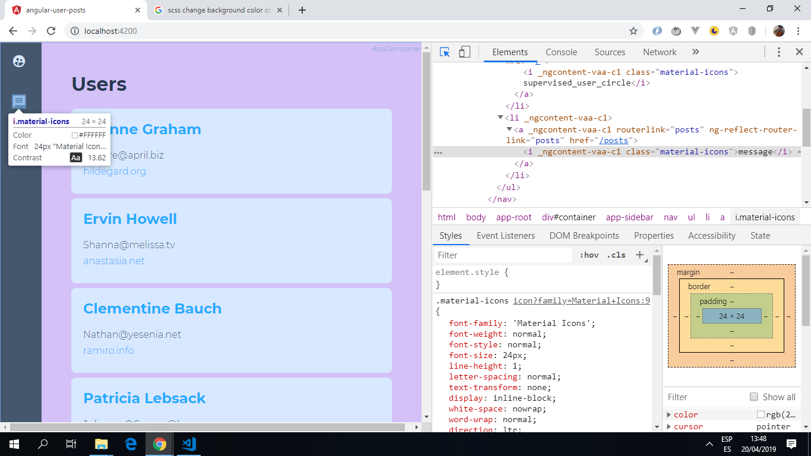
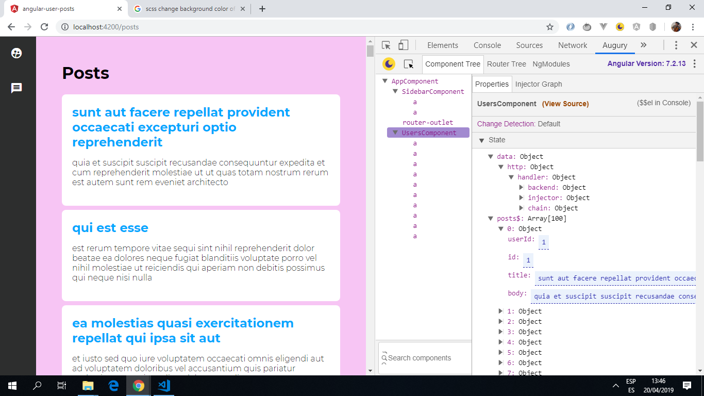

# :zap: Angular API User Posts

* App to get user details and posts from an external [JSONPlaceholder](https://jsonplaceholder.typicode.com) API.

*** Note: to open web links in a new window use: _ctrl+click on link_**

## :page_facing_up: Table of contents

* [:zap: Angular API User Posts](#zap-angular-api-user-posts)
  * [:page_facing_up: Table of contents](#page_facing_up-table-of-contents)
  * [:books: General info](#books-general-info)
  * [:camera: Screenshots](#camera-screenshots)
  * [:signal_strength: Technologies](#signal_strength-technologies)
  * [:floppy_disk: Setup](#floppy_disk-setup)
  * [:computer: Code Examples](#computer-code-examples)
  * [:cool: Features](#cool-features)
  * [:clipboard: Status & To-Do List](#clipboard-status--to-do-list)
  * [:clap: Inspiration](#clap-inspiration)
  * [:file_folder: License](#file_folder-license)
  * [:envelope: Contact](#envelope-contact)

## :books: General info

* Angular routing module allows user to navigate between Users and Posts pages.
* Angular httpClient used to get API data.
* Sidebar with [Google Material](https://material.io/) icons and links to pages.
* Tutorial code - see [:clap: Inspiration](#clap-inspiration) below

## :camera: Screenshots

.
.

## :signal_strength: Technologies

* [Angular 13](https://angular.io/)
* [RxJS Library v7](https://angular.io/guide/rx-library) used to [subscribe](http://reactivex.io/documentation/operators/subscribe.html) to the API data [observable](http://reactivex.io/documentation/observable.html).
* [Google Material](https://material.io/) icons used.

## :floppy_disk: Setup

* Run `npm i` to install dependencies.
* Run `ng serve` for a dev server.
* Navigate to `http://localhost:4200/`. The app will automatically reload if you change any of the source files.

## :computer: Code Examples

* `data.service.ts` using httpClient service with functions to get users, userIds and posts.

```typescript

import { Injectable } from '@angular/core';
import { HttpClient } from '@angular/common/http';

@Injectable({
  providedIn: 'root'
})
export class DataService {

  constructor(private http: HttpClient) { }

  getUsers() {
    return this.http.get('https://jsonplaceholder.typicode.com/users')
  }

  getUser(userId) {
    return this.http.get('https://jsonplaceholder.typicode.com/users/'+userId)
  }

  getPosts() {
    return this.http.get('https://jsonplaceholder.typicode.com/posts')
  }
}

```

## :cool: Features

* Angular httpClient used to get data from an external API.
* Material icons used.
* Updated to latest Angular version with all dependency conflicts resolved.

## :clipboard: Status & To-Do List

* Status: Working.
* To-Do: Nothing

## :clap: Inspiration

* [Coursetro Tutorial written version: Angular 6 Tutorial - Learn Angular 6 in this Crash Course](https://coursetro.com/posts/code/154/Angular-6-Tutorial---Learn-Angular-6-in-this-Crash-Course)

## :file_folder: License

* N/A

## :envelope: Contact

* Repo created by [ABateman](https://github.com/AndrewJBateman), email: gomezbateman@yahoo.com
